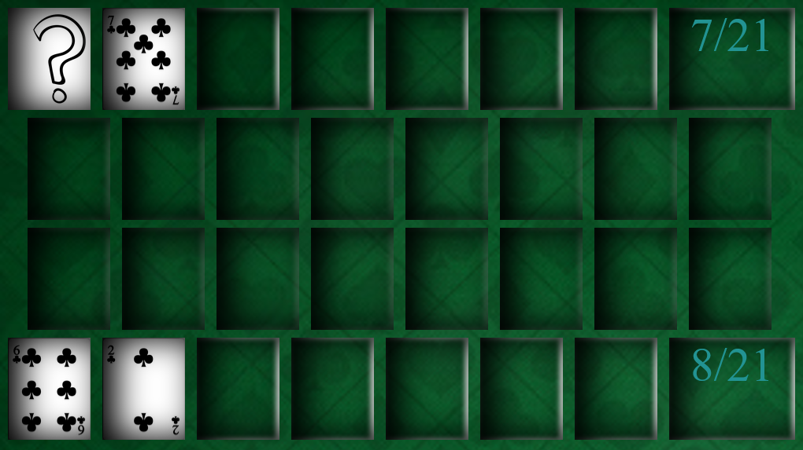
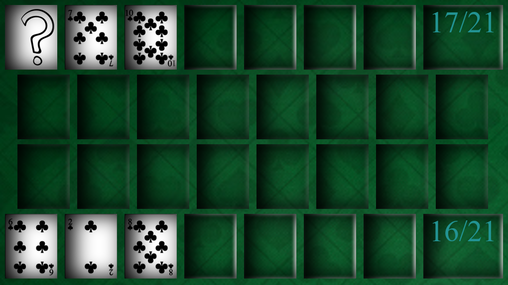
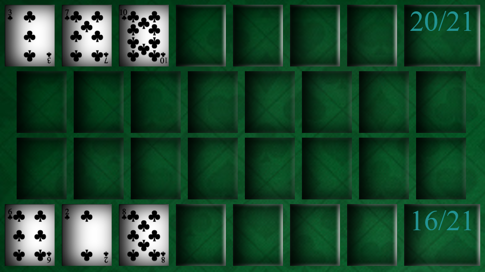

# Blackjack

Projeto pessoal feito em Javascript, CSS e HTML inspirado no jogo Blackjack.

O objetivo do jogo é comprar cartas e tentar bater 21, ganhando o jogador que chegar mais perto deste número.

Para se obter sucesso, é necessário realizar contagens de cartas e ponderar sobre qual a carta o adversário está escondendo e, tendo isso como base manter as cartas ou solicitar mais uma.

No caso acima ambos os jogadores estão com um número baixo, então os dois solicitam mais cartas:

Agora o 2° jogador resolve manter as cartas pois crê que o adversário irá ultrapassar o 21 quando sua carta secreta for revelada. 
O jogador 1 também mantém a mão e a carta é revelada:

O jogador 1 (robô), venceu pois chegou mais perto do 21 do que o 2° jogador.
